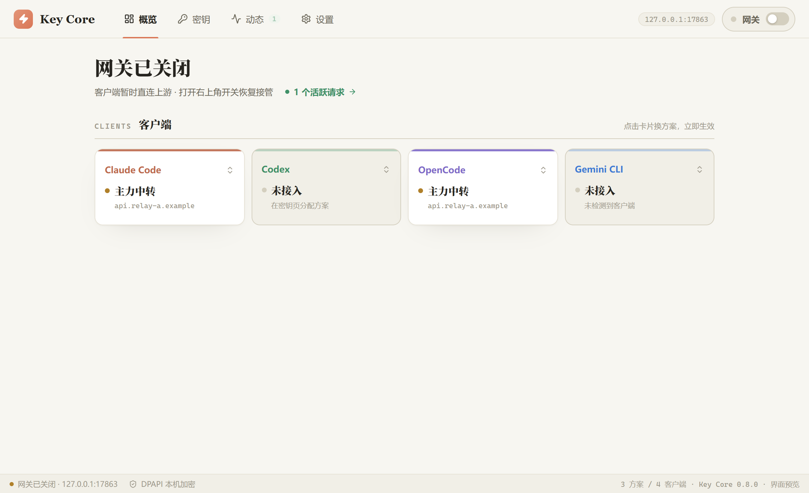
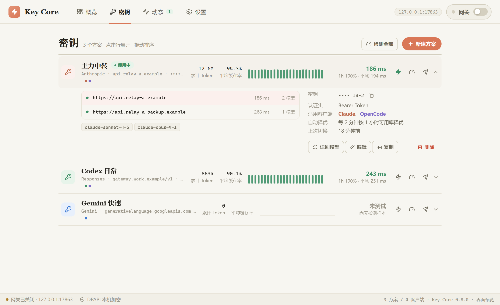
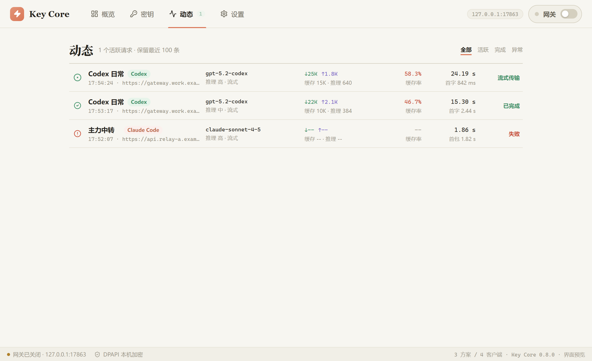
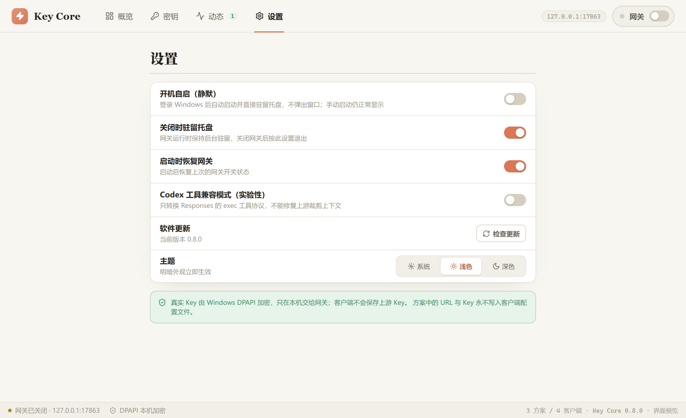
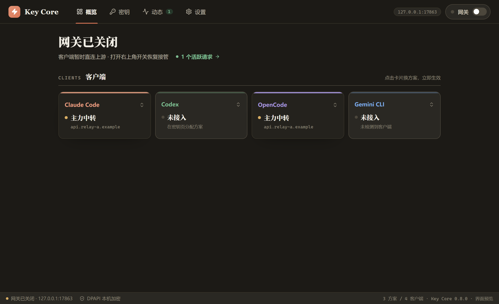

<div align="center">


# Key Core

**纯本地的 API 方案管理器与回环网关**

换中转不用改客户端配置 · Key 加密不落地 · 请求实时可观测

[](https://github.com/trygn35-ui/keydeck/releases/latest)
[](https://github.com/trygn35-ui/keydeck/releases)
[](#下载与安装)
[](LICENSE)

[下载与安装](#下载与安装) · [快速开始](#快速开始) · [工作原理](#工作原理) · [安全与隐私](#安全与隐私) · [FAQ](#faq)



</div>

---

## 为什么需要 Key Core

如果你同时用 Claude Code、Codex、OpenCode 或 Gemini CLI，并且手上不止一家中转，大概率遇到过这些事：

- **换一家中转要翻配置文件**。`settings.json`、`config.toml`、环境变量各改一遍，改错了还得回滚。
- **API Key 明文躺在各处**。客户端配置、`.env`、shell 历史里到处都是你的 Key。
- **同一个 Key 填很多遍**。四个客户端四种配置格式，加一个方案就要重复四次。
- **请求出问题看不到现场**。是自己配错了、Key 过期了，还是上游在限流？只能靠猜。

Key Core 把这些收敛到一处：**方案存在本地，客户端只认一个固定的回环地址，换方案在界面上点一下就好。**

|  | 手动改配置 | 环境变量脚本 | **Key Core** |
| --- | --- | --- | --- |
| 切换方案 | 改多个文件，易出错 | 需重开终端 | **点一下，客户端零改动** |
| Key 存放 | 明文散落各处 | 明文在脚本里 | **DPAPI 加密，不写入客户端** |
| 多客户端同步 | 每个都要改 | 每个都要导 | **一次分配，同时生效** |
| 请求可观测 | 无 | 无 | **实时首字、Token、缓存率** |
| 上游故障 | 手动排查再切 | 手动切 | **自动择优切到可用线路** |

## 核心特性

- **一键切换方案** — 网关运行时切换只更新内存路由，客户端配置一个字节都不动，已发出的请求不受影响。
- **本地回环网关** — 只监听 `127.0.0.1`，为四个客户端提供独立路径槽，不是任意目标的开放代理。
- **Key 不落客户端** — 真实 URL 与 Key 只交给网关；客户端里只有本地地址和随机本地令牌。
- **请求实时监控** — 首字/首包时延、Token 用量、缓存命中率、推理强度，按色阶一眼看出异常。
- **URL 池与自动择优** — 一个方案最多 20 条线路，按 1 小时可用率与平均延迟自动切到最优；当前线路失败立即让路。
- **渠道实测** — 用真实 Key 发一条最小消息，量真实可用性与时延，并回显上游计量的 Token 用量。
- **纯本地运行** — 没有服务端、没有账号、没有遥测，断网也能管理方案。

## 工作原理

```text
Claude Code ─┐                                       ┌─ 方案 A：主力中转
Codex ───────┤                                       ├─ 方案 B：备用中转
OpenCode ────┼──▶  127.0.0.1:17863（Key Core 网关）──┼─ 方案 C：官方直连
Gemini CLI ──┘         注入真实 URL 与 Key           └─ …
```

1. 客户端里**只写一次** `http://127.0.0.1:17863/...`，之后再也不用改。
2. 网关收到请求后剥离本地令牌，按当前方案注入真实的上游地址与 Key，再原样转发。
3. 在界面上换方案 = 换网关的内存路由。**客户端毫无察觉，不需要重启。**
4. 关闭网关时，Key Core 只把接管前的那几个字段还原回去，你在此期间新增的 MCP、插件、注释都会保留。

## 截图

<details open>
<summary><b>密钥管理</b> — 拖动排序、累计用量、健康时间线、一键切换与实测</summary>
<br>

</details>

<details>
<summary><b>请求监控</b> — 首字时延、Token、缓存率实时刷新</summary>
<br>

</details>

<details>
<summary><b>设置</b> — 静默自启、托盘驻留、主题与自动更新</summary>
<br>

</details>

<details>
<summary><b>深色主题</b></summary>
<br>

</details>

## 下载与安装

前往 **[Releases](https://github.com/trygn35-ui/keydeck/releases/latest)** 下载：

| 文件 | 说明 |
| --- | --- |
| `Keydeck-Setup-<版本>-x64.exe` | 安装版，**支持自动更新**，推荐 |
| `Keydeck-Portable-<版本>-x64.exe` | 便携版，免安装，不支持自动更新 |
| `SHA256SUMS-<版本>.txt` | 校验和，可核对安装包完整性 |

**系统要求**：Windows 10 (1809+) 或 Windows 11，x64。无需额外运行时。

> [!NOTE]
> 当前构建没有商业代码签名证书，首次运行时 Windows SmartScreen 会提示“未知发布者”。
> 点击 **更多信息 → 仍要运行** 即可。介意的话可以先用 `SHA256SUMS` 核对安装包，或直接从源码构建。

## 快速开始

1. **新建方案** — 在「密钥」页点新建，填入方案名、API 协议、上游 URL 和 Key。Key 输入后立即加密保存。
2. **勾选适用客户端** — 一个方案可以同时供多个协议兼容的客户端使用。
3. **分配给客户端** — 在「概览」页点客户端卡片选择方案，或在密钥行点 ⚡ 一键切换。
4. **打开网关** — 点右上角「网关」开关，Key Core 会把客户端的 Base URL 指向本地回环地址。
5. **照常使用客户端** — 请求经网关转发，在「动态」页实时查看时延与用量。

之后再换方案只需重复第 3 步——**不用碰任何配置文件，不用重启客户端。**

## 客户端支持

| 客户端 | 接入位置 | Key Core 管理的字段 |
| --- | --- | --- |
| Claude Code | `~/.claude/settings.json` | 本地 Base URL、本地认证、可选模型与 Tool Search |
| Codex | `~/.codex/config.toml` | 仅当前 provider 的 `base_url` |
| OpenCode | `~/.config/opencode/opencode.json(c)` | `provider.keydeck_gateway`、模型选择与本地认证 |
| Gemini CLI | `~/.gemini/.env`、`~/.gemini/settings.json` | 本地 Base URL、本地认证、可选模型与认证类型 |

支持 `CLAUDE_CONFIG_DIR`、`CODEX_HOME`、`GEMINI_CLI_HOME`、`OPENCODE_CONFIG`、`XDG_CONFIG_HOME` 与 `XDG_DATA_HOME` 路径覆盖。

<details>
<summary>Key Core 如何保护你已有的配置</summary>
<br>

- JSON/JSONC 使用结构化定点编辑，保留注释、未知字段、插件、Hooks 和权限设置。
- Codex 只修改接管时活跃 provider 的 `base_url`，不创建新 provider，不碰 `model`、`wire_api`、认证字段和 `auth.json`。
- 首次接管时捕获字段级基线，并保存一份 DPAPI 加密的完整原文件作为紧急恢复依据。
- 关闭网关时只恢复这些受管字段，**不做整文件回滚**，运行期间新增的 MCP、project、注释继续保留。
- 如果你手动把 provider 切走了，Key Core 视为已解除接管并跳过恢复。
- 多文件写入先预检再原子替换，失败时回滚已写文件。

</details>

## 安全与隐私

这是一个处理 API Key 的工具，所以下面每一条都写成**可验证的事实**，而不是承诺：

- **没有服务端、没有账号、没有遥测。** 除了你自己配置的上游地址，Key Core 不向任何服务器发起请求，你可以用抓包工具自行确认。
- **Key 用 Windows DPAPI 加密**（Electron `safeStorage`，绑定当前 Windows 用户），密文存在 `%APPDATA%\Keydeck\data\profiles.json`。换个用户或换台机器都解不开。
- **真实 Key 永不写入客户端配置文件。** 客户端里只有 `127.0.0.1` 地址和一个随机本地令牌。列表与状态 IPC 不返回明文 Key；复制操作由主进程直接写入系统剪贴板。
- **不保存请求正文。** 请求监控只记录时延、Token 计数、模型名等元数据，任何时候都不落盘请求或响应内容。
- **网关只绑定回环地址**，不监听局域网，且只为四个客户端提供固定路径槽，不是通用代理。
- **可校验的安装包** — 每个 Release 附带 `SHA256SUMS`，源码完全开放，可自行构建比对。

> [!IMPORTANT]
> 你需要自行以合法方式获取上游或中转服务的 API Key，并遵守其服务条款与所在地法律法规。
> Key Core 只是本地工具，不提供任何 API 服务，也不对你使用的上游服务负责。

## 数据目录

```text
%APPDATA%\Keydeck\data\
├── profiles.json           方案与 DPAPI 加密的 Key 密文
├── gateway.json            监听设置、持久化路由与加密本地令牌
├── gateway-recovery.json   接管前的受管字段基线（DPAPI 加密）
├── settings.json           自启、托盘、主题与实验功能
├── requests.json           最近 100 条请求元数据（不含正文）
└── window-state.json       窗口位置与大小
```

卸载后如需彻底清理，删除上面整个目录即可。

## 自动更新

安装版通过 GitHub Releases 自动更新：在设置页检查更新、后台下载，重启即可安装。
**安装前会先停止网关并恢复客户端配置**，因此更新不会把客户端留在失效的本地地址上。
便携版无法就地替换自身，只提示新版本并引导到下载页。

## FAQ

<details>
<summary><b>Windows 提示“未知发布者”或被杀软拦截？</b></summary>
<br>

没有购买代码签名证书（一年数千元），所有未签名的 Electron 应用都会这样。
点击 **更多信息 → 仍要运行**。介意的话请核对 `SHA256SUMS`，或从源码自行构建。

</details>

<details>
<summary><b>端口 17863 被占用了怎么办？</b></summary>
<br>

网关会报错并保持关闭。端口目前存在数据目录的 `gateway.json` 里，关闭应用后修改 `port` 字段再启动即可。

</details>

<details>
<summary><b>切换方案需要重启客户端吗？</b></summary>
<br>

不需要。网关运行时切换只改内存路由，客户端配置字节不变。
已经发出的请求继续使用开始时的上游，新请求走新方案。

</details>

<details>
<summary><b>Key 存在哪里？换电脑怎么迁移？</b></summary>
<br>

存在 `%APPDATA%\Keydeck\data\profiles.json`，用 DPAPI 加密并**绑定当前 Windows 用户**。
正因如此，直接把这个文件拷到另一台机器是**解不开的**——换机后需要重新录入 Key。

</details>

<details>
<summary><b>请求记录会保存我的对话内容吗？</b></summary>
<br>

不会。只记录时延、Token 数量、模型名等元数据，请求与响应正文任何时候都不落盘。

</details>

<details>
<summary><b>关闭网关后，客户端配置会变回去吗？</b></summary>
<br>

会。Key Core 只把首次接管时改动的那几个字段还原回去，其他内容（包括你在此期间新增的 MCP、插件、注释）原样保留。
如果检测到受管字段被外部修改，会拒绝停止网关，以免覆盖你的改动。

</details>

<details>
<summary><b>和 one-api / new-api / claude-code-router 有什么不同？</b></summary>
<br>

那些是**服务端**中转分发平台：要部署、有数据库、面向多用户。
Key Core 是**桌面单机工具**：不部署、不联网、只服务你自己的几个 CLI 客户端，
核心价值在于「换方案不用改客户端配置」和「Key 加密不落地」。

</details>

## 开发

需要 Node.js 22 与 pnpm。

```powershell
pnpm install --frozen-lockfile
pnpm test        # 单元测试（使用临时目录，不读写真实配置）
pnpm dev         # 开发模式
pnpm dist        # 打包 Windows 安装版与便携版
pnpm release     # 整理交付件与校验和
```

技术栈：Electron + React + TypeScript。主进程负责全部文件写入与密钥处理，渲染进程没有文件系统权限。

## 致谢

- [Electron](https://www.electronjs.org/) · [electron-builder](https://www.electron.build/) · [electron-updater](https://www.electron.build/auto-update)
- [Lucide](https://lucide.dev/) 图标
- 灵感来自社区中各类 LLM 网关与中转管理工具

## License

[MIT](LICENSE)
